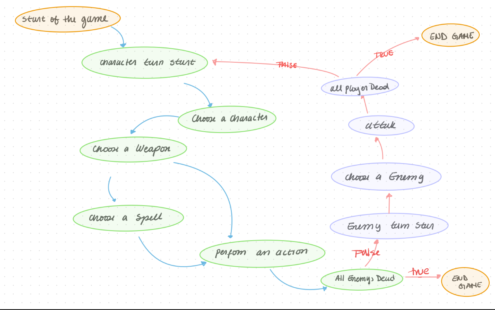

# Final Reality

Final Reality is a simplified clone of the renowned game, Final Fantasy. Its main purpose is to
serve as an educational tool, teaching foundational programming concepts.

This README is yours to complete it. Take this opportunity to describe your contributions, the
design decisions you've made, and any other information you deem necessary.

This project is licensed under the
[Creative Commons Attribution 4.0 International License](https://creativecommons.org/licenses/by/4.0/).

We've opted for a flexible design by defining Character as a trait. This decision allows for various character types to
be defined, each with its own set of attributes and abilities. For example, we've defined character types such as Ninja,
Warrior, Paladin,  etc., each with distinct values for attributes like livePoints, defending, weight, etc.
It was decided that our characters, ninjas, paladins, etc. will have the same characteristics, which is why they are 
initialized with names like life points, etc.

Magical Character Trait
To further enhance gameplay diversity, we've introduced the MagicalCharacter trait, which extends the 
Character trait. This allows characters to possess magical abilities in addition to their regular attributes.
By extending Character, magical characters inherit all the properties and methods defined in the base trait, enabling 
seamless integration of magical and non-magical characters within the game world.

For weaponry, it was also considered similar to the character package, defining a 'weapon' trait and another one that
extends from it called 'magicalWeapon', with each class already defining the name and data.

For Tarea 2, modifications were made based on the submission from Tarea 1. The 'attack' is no longer a class but has
been added as a method to characters and enemies, reflecting what each can perform. Several variables such as livePoints 
and manaPoints were created to allow for updates when attacking or casting a spell (an immutable variable was also maintained
to store the maximum values for the respective characters). All spells were given both a cost and a percentage, 
and for those characters that do not use percentage-based spells, the percentage was set to zero.

For Tarea 3, the game controller, game model, and game view were implemented using the State pattern. The logic behind 
this is as follows: when the game starts, a character must be chosen along with the weapon to equip.
Once this is done, the game transitions to the ActionState, where the player can choose to add an ally, 
cast a spell, or attack. They can also choose a weapon (this command is available in case the initial weapon
selection is incorrect, i.e., the chosen weapon is already equipped or the character cannot use the 
selected weapon). When adding a character, it will be added to the party; thus, no more than three 
characters can be added, and the game will only take the first three chosen characters. For attacking, 
a turn-based system is used where the character with the highest action bar attacks first. In the case of 
enemies, a character that is in the party and still alive is chosen randomly. Spells can only be equipped 
by magical characters.
Additionally, effects were implemented for each spell, where a duration was assigned, and isActive was defined to
check if the enemy has the turn or loses it. Once the spell's effect duration ends, isActive is set to false
again.

We can see in the following diagram a more general explanation of what was intended to be implemented compared to the 
previous description and the first diagrama .
